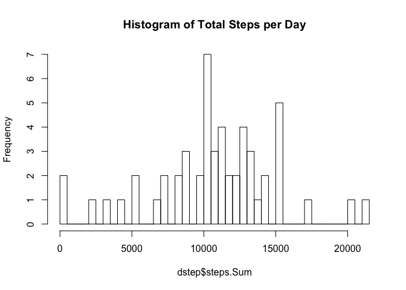
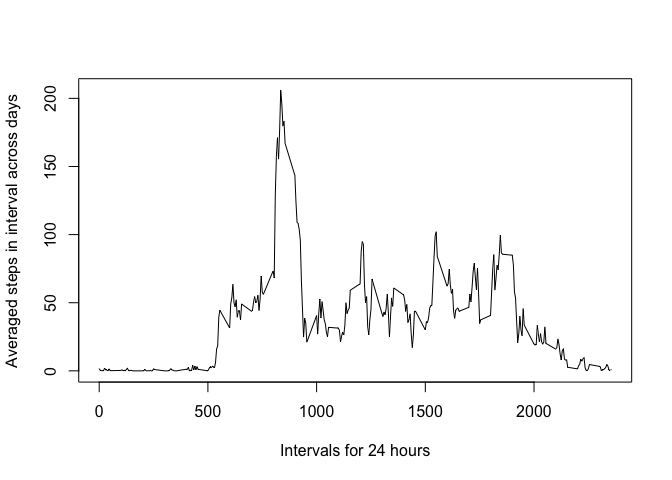
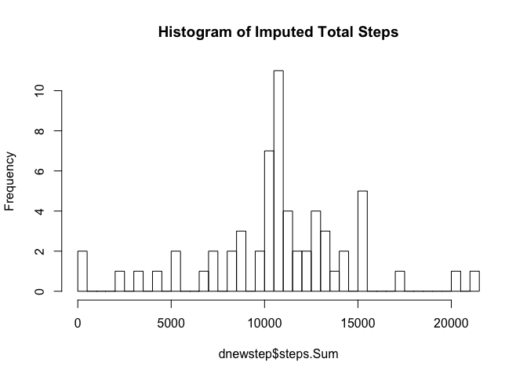
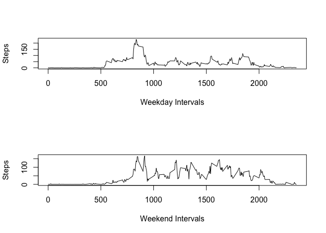

This assignment makes use of data from a personal activity monitoring device. This device collects data at 5 minute intervals through out the day. The data consists of two months of data from an anonymous individual collected during the months of October and November, 2012 and include the number of steps taken in 5 minute intervals each day.

**steps**: Number of steps taking in a 5-minute interval (missing values are coded as `NA`)
**date**: The date on which the measurement was taken in YYYY-MM-DD format
**interval**: Identifier for the 5-minute interval in which measurement was taken

## Loading and preprocessing the data

```r
library(data.table)
```

```
## Warning: package 'data.table' was built under R version 3.4.2
```

```r
# unzip and load data to a data.table
data <- fread(unzip("activity.zip"))
# create and apply a weekend factor variable and convert data column
weekdays <- c('Monday', 'Tuesday', 'Wednesday','Thursday', 'Friday')
data$date <- as.Date(data$date)
```

```
## Warning in strptime(xx, f <- "%Y-%m-%d", tz = "GMT"): unknown timezone
## 'default/America/Denver'
```

```r
data$wEnd <- factor((weekdays(data$date) %in% weekdays), levels=c(FALSE, TRUE), labels=c('weekend', 'weekday'))
```
## What is mean total number of steps taken per day?

```r
dstep<- data[,.(steps.Sum=sum(steps)),by=date]
hist(dstep$steps.Sum, breaks=40, main="Histogram of Total Steps per Day")
```

<!-- -->

```r
paste("Mean is", mean(dstep$steps.Sum, na.rm=TRUE))
```

```
## [1] "Mean is 10766.1886792453"
```

```r
paste("Median is", median(dstep$steps.Sum, na.rm=TRUE))
```

```
## [1] "Median is 10765"
```
## What is the average daily activity pattern?

```r
intstep <- data[,.(int.mean=mean(steps, na.rm=TRUE)),by=data$interval]
plot(intstep$data, intstep$int.mean, type = "l", xlab="Intervals for 24 hours", ylab="Averaged steps in interval across days")
```

<!-- -->

```r
maxint<-intstep[,.SD[which.max(int.mean)]]
paste("The", maxint$data, "interval has the most steps")
```

```
## [1] "The 835 interval has the most steps"
```
## Imputing missing values

```r
paste("There are", sum(is.na(data$steps)), "NA values")
```

```
## [1] "There are 2304 NA values"
```

```r
datanew <- data
for (i in 1:nrow(datanew)){
        if(is.na(datanew$steps[i])){
                interval_val <- datanew$interval[i]
                datanew$steps[i] <- intstep$int.mean[intstep$data == interval_val]
        }
}
dnewstep<- datanew[,.(steps.Sum=sum(steps)),by=date]
hist(dnewstep$steps.Sum, breaks=40, main="Histogram of Imputed Total Steps")
```

<!-- -->

```r
paste("Imputed Data Mean is", mean(dnewstep$steps.Sum))
```

```
## [1] "Imputed Data Mean is 10766.1886792453"
```

```r
paste("Imputed Data Median is", median(dnewstep$steps.Sum))
```

```
## [1] "Imputed Data Median is 10766.1886792453"
```
#### Interesting impact, the filling of missing values brought the median up to equal the mean. It did not seem to notably change the values or histogram otherwise, but I used the mean in each interval.  

## Are there differences in activity patterns between weekdays and weekends?

```r
dataweekday <- datanew[datanew$wEnd == 'weekday']
dataweekend <- datanew[datanew$wEnd == 'weekend']
intstepweekday <- dataweekday[,.(int.mean=mean(steps, na.rm=TRUE)),by=dataweekday$interval]
intstepweekend <- dataweekend[,.(int.mean=mean(steps, na.rm=TRUE)),by=dataweekend$interval]
par(mfrow = c(2,1))
plot(intstepweekday$data, intstepweekday$int.mean, type = "l", xlab="Weekday Intervals", ylab="Steps")
plot(intstepweekend$data, intstepweekend$int.mean, type = "l", xlab="Weekend Intervals", ylab="Steps")
```

<!-- -->
  
#### Overall, the weekend steps show more irregularity and dispersion throughout the day. The weekday interval appears to correlate with the commute to and from work in morning and afternoon, and perhaps morning workouts.  

### Closeout Comments - This was an interesting assignment, the hardest part was the looping for imputing the NA values, I struggled with it for a while. I thought there was a way to do it using SAPPLY logic, but the problem was passing the interval 'lookup' value for replacement into the function, and since I didn't want to get into complicated environment ideas or parent frame/lazy processing, I went with the for loop. Fellow Students - Would love feedback on how you did it.
